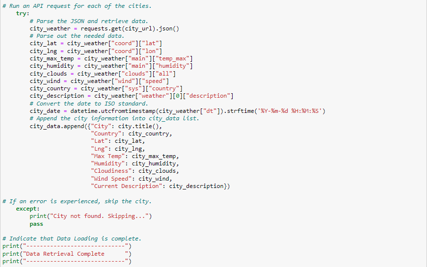
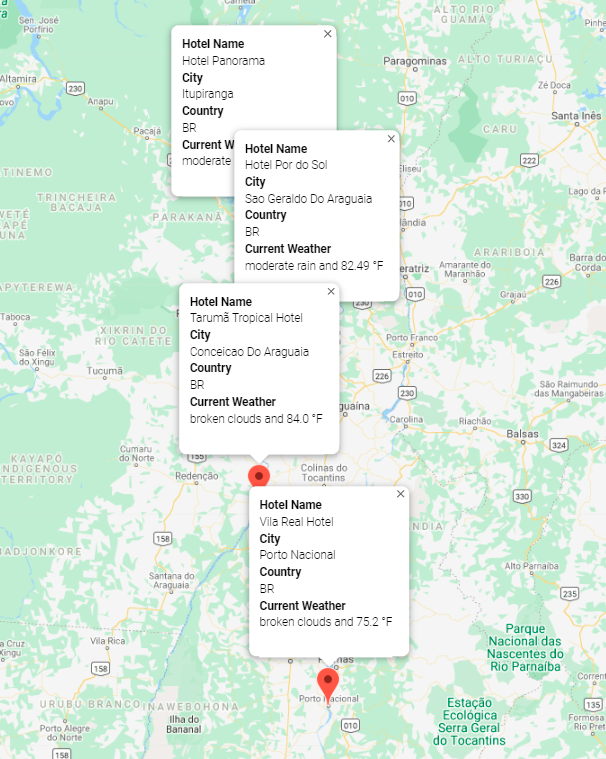

# World_Weather_Analysis

### Overview
Working with Jack on the PlanMyTrip app, we've worked on some new changes if we can make it through this round of Beta testing, we will be ready to take this app to the stratosphere!  We can plan on clear skies, if we map out our destination accordingly.  

## Deliverable One
**First, we need to retrieve the data we're going to be working with from the API call, we'll be looking at:**
- Latitude and longitude
- Maximum temperature
- Percent humidity
- Percent cloudiness
- Wind speed
- Weather description (i.e.: clouds, fog, light rain, clear sky)

 
   

**Next, we'll add that data to a DataFrame:**

   

**We will then export our DataFrame as WeatherPy_Database.csv into the Weather_Database folder, where we'll be able to continue our work from there!**

  

## Deliverable Two
**We're ready to see if this app will work with our customer's needs, let's check and see if the input statements are written to prompt the customer for their minimum and maximum temperature preferences.**

    

**Create a new DataFrame based on the minimum and maximum temperature, and empty rows are dropped.**

  
 
**The hotel name is retrieved and added to the DataFrame, and the rows that don’t have a hotel name are dropped.**

**The DataFrame is exported as a CSV file into the Vacation_Search folder and is saved as Vacation_Search.csv.**

**We've created a marker layer map with pop-up markers for the cities in the vacation DataFrame is created, and it is uploaded as a PNG. Each marker has the following information:**
- Hotel name
- City
- Country
- Current weather description with the maximum temperature

**Let's make sure it's showing our clients what they want to see!**

## Deliverable Three
**Now let's map out a 4 city itinerary for our client and put this app to the test! Creating a DataFrame that shows each of our four cities.**

    

**The latitude and longitude pairs for each of the four cities are retrieved.**

  

**A directions layer map between the cities and the travel map is created and uploaded as WeatherPy_travel_map.png. What an adventure our clients will have zipping from city to city!**

**A marker layer map with a pop-up marker for the cities on the itinerary is created, and it is uploaded as WeatherPy_travel_map_markers.png. Each marker has the following information:**
- Hotel name
- City
- Country
- Current weather description with the maximum temperature

**Book me at the Hotel Por do Sol, the weather looks incredible!**

## SUMMARY
After working through another run with Jack on the PlanMyTrip app, we are pleased with how the tool is perfoming.  Our outlook is sunny, and we anticipate fair winds in our business venture. Not a cloud in sight.

